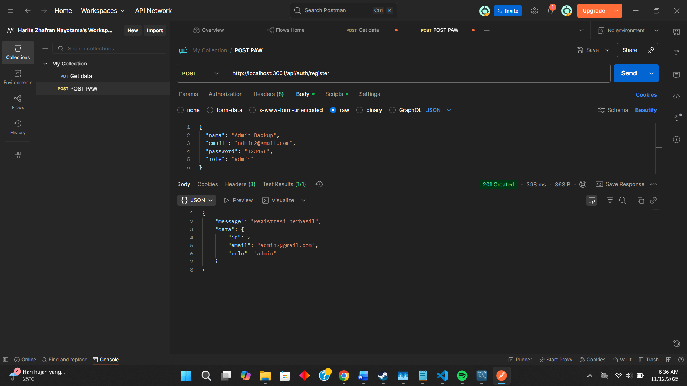
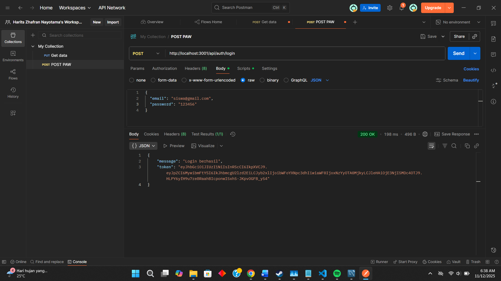
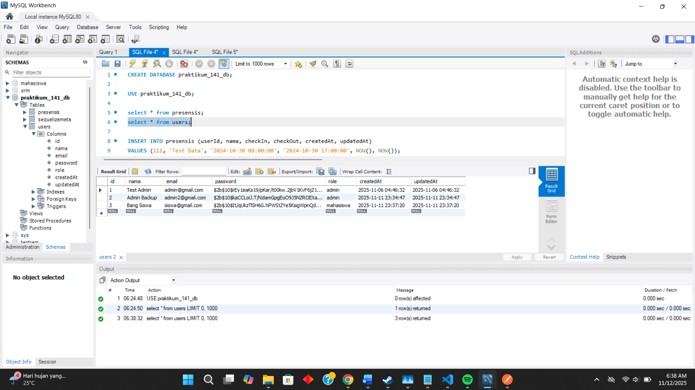

o	Request POST /register (untuk membuat user "mahasiswa") :

o	Request POST /register (untuk membuat user "admin") :

o	Request POST /login (login sebagai "mahasiswa" dan mendapatkan token) :

o	Database table user :

